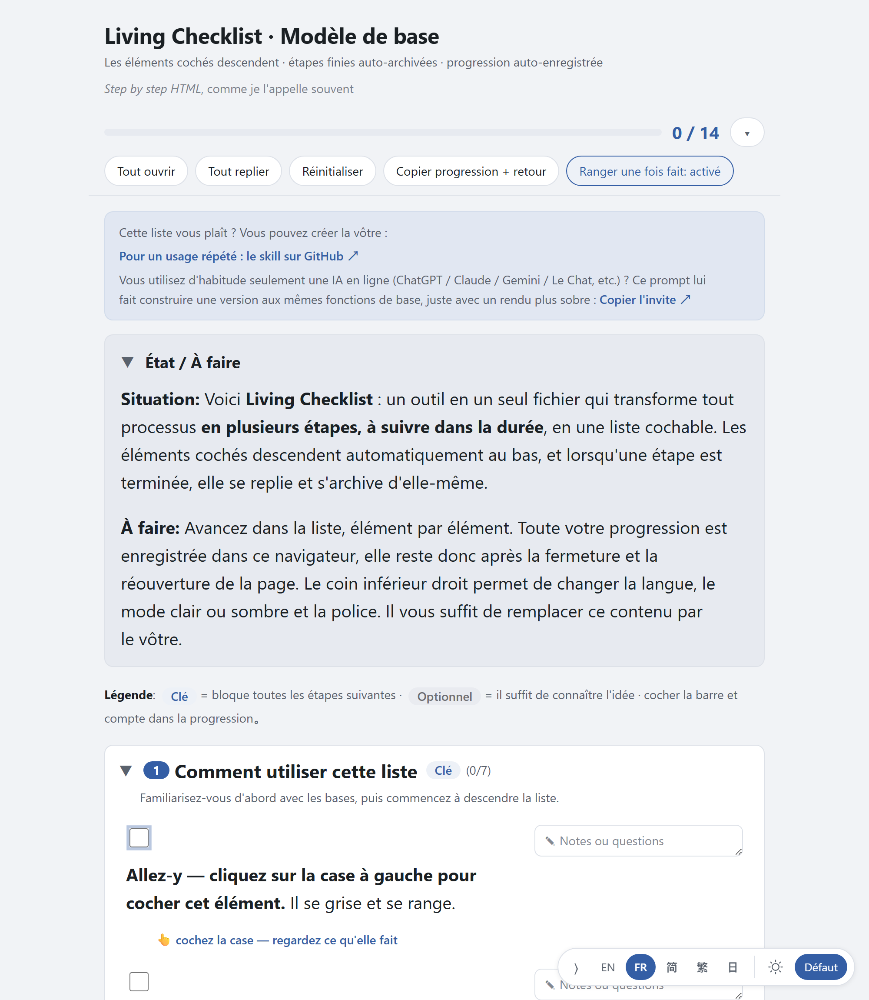
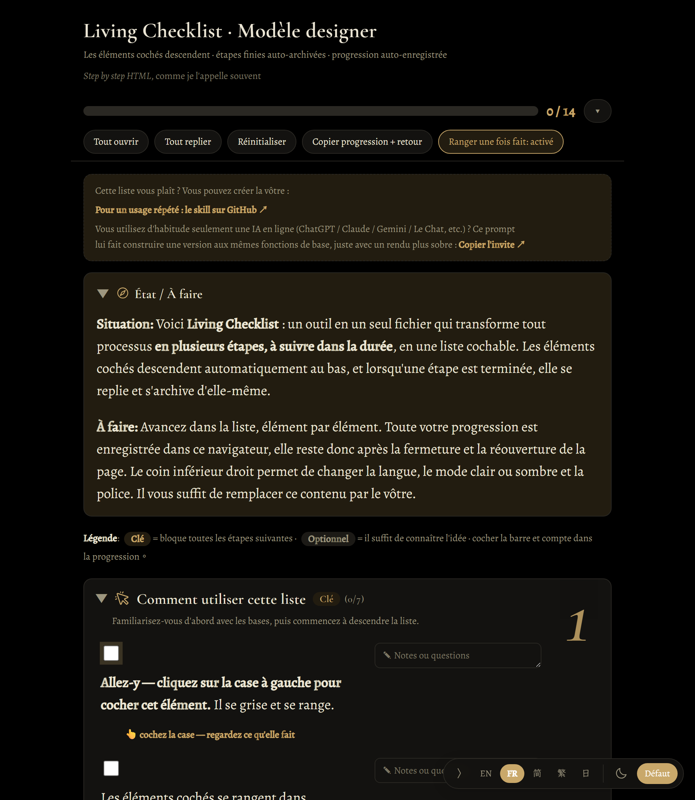
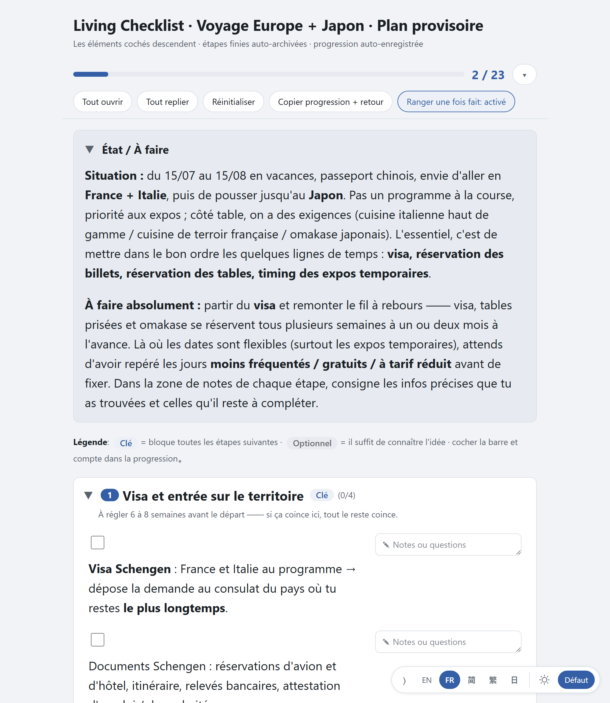

# Living Checklist

[English](README.md) · **Français** · [简体中文](README.zh.md) · [繁體中文](README.zh-Hant.md) · [日本語](README.ja.md)

[](https://github.com/MtsYama/living-checklist/stargazers)

> **Ça vous est utile ?** Une ⭐ Star est le meilleur des encouragements, et partagez-le avec ceux que ça pourrait aider.
> Me suivre : [GitHub @MtsYama](https://github.com/MtsYama) · [LinkedIn](https://www.linkedin.com/in/zhengshen-shu/)

> **Essayez-le en ligne (rien à installer) :** https://mtsyama.github.io/living-checklist/

## Installation (un copier-coller)

Si vous utilisez Claude Code, ajoutez ce dépôt comme place de marché de plugins, puis installez le skill :

```
/plugin marketplace add MtsYama/living-checklist
/plugin install living-checklist@living-checklist
```

Ensuite, lancez `/living-checklist:living-checklist`, ou demandez simplement à votre IA *« fais-moi une checklist pour X »* — elle remplit un modèle à votre place.

Vous n'utilisez pas Claude Code ? Deux autres voies : clonez ce dépôt dans `~/.claude/skills/living-checklist/`, ou sautez l'installation et [copiez le prompt](#trois-façons-de-lutiliser) dans n'importe quelle conversation IA sur le web. Voir [Trois façons de l'utiliser](#trois-façons-de-lutiliser) plus bas.

> Un seul fichier HTML qui transforme n'importe quel processus étape par étape en une checklist vivante qui se sauvegarde toute seule.

*Step by step HTML*, c'est comme ça que je l'appelle habituellement.


**Living Checklist** est un unique fichier `.html` autonome. CSS intégré, JS intégré, zéro dépendance. Double-cliquez dessus et il s'ouvre directement depuis `file://` dans votre navigateur. Aucune étape de build, aucun serveur, aucune connexion internet nécessaire pour le faire fonctionner.

Vous ne modifiez pas de code pour l'utiliser. Vous modifiez le *contenu* (une petite section DATA + CONFIG avec des repères « remplissez vos données ici ») et le moteur en dessous reste intact. Ensuite, tout prend vie : cochez un élément et il se range dans un groupe repliable « ✓ Terminé » en haut de son étape, terminez une étape entière et la carte reçoit un badge « ✓ Terminé » et se replie sur place, et une barre de progression suit l'ensemble. Chaque coche, repli et note est enregistré automatiquement dans votre navigateur. Fermez l'onglet et rouvrez-le plus tard : votre progression est exactement là où vous l'aviez laissée.

**Ce que c'est (et ce que ce n'est pas).** Ce n'est pas une application finie que vous installez. C'est une façon de générer une checklist *vivante* avec une IA, ou à la main : décrivez ce dont vous avez besoin à une IA (ChatGPT, Claude, et autres), ou modifiez le fichier vous-même, et il en sort un seul fichier HTML que vous double-cliquez pour l'utiliser. L'outil lui-même ne contient aucune IA ; il s'appuie sur *votre* IA pour construire la checklist. Plus tard, il pourra devenir une application autonome qui se synchronise avec Notion et des outils similaires. Pas encore ; aujourd'hui, c'est ce seul fichier plus une skill Claude.

**À qui ça s'adresse.** Aux personnes qui utilisent déjà l'IA, qui aiment les checklists et qui veulent qu'une IA leur en prépare une souvent ; ou à celles qui trouvent les outils de checklist existants un peu rigides et qui ont envie d'essayer autre chose. Pas encore aux personnes qui veulent une application soignée, prête à l'emploi et déjà reliée à Notion d'entrée de jeu.

## Captures d'écran

| Modèle de base (clair) | Modèle MX Studio (sombre) | Exemple concret |
|---|---|---|
|  |  |  |

Le modèle par défaut est livré en deux couleurs nettes — **Lapis blue** (par défaut) et **Burgundy** — plus l'habillage sombre de créateur **MX Studio**.

## Démarrage rapide

1. Téléchargez ou copiez un modèle depuis [`templates/`](templates/) — commencez par [`base.html`](templates/base.html).
2. Double-cliquez dessus. Il s'ouvre dans votre navigateur.
3. C'est tout. Cliquez sur les éléments pour les cocher, saisissez des notes, regardez les étapes se replier à mesure que vous les terminez.

Pour le rendre *vôtre*, ouvrez le fichier dans n'importe quel éditeur de texte et modifiez les deux sections clairement repérées près du haut : `[1] DATA` (vos étapes et vos éléments) et `[2] CONFIG` (titre, langues, thème). Le code du moteur qui les suit n'a jamais besoin d'être touché.

## Ce qu'il fait concrètement

- **Les éléments cochés se rangent** — une animation FLIP fluide range les éléments terminés dans un groupe repliable « ✓ Terminé » en haut de leur étape, de sorte que ce qu'il reste à faire demeure en vue. (Vous ne voulez pas ? Désactivez « Ranger une fois terminé » dans la barre d'outils.)
- **Les étapes se replient sur place** — terminez chaque élément d'une étape et la carte entière reçoit un badge « ✓ Terminé » et se replie là où elle est. Rien n'est déplacé en bas de la page.
- **Une note par élément** — chaque élément a son propre champ de note. Notez une remarque, une question, une valeur à remplir plus tard ; c'est enregistré automatiquement et ça repart quand vous copiez votre progression.
- **Sous-checklists imbriquées** — n'importe quel élément peut ouvrir une sous-liste plus fine en dessous, pour quand une ligne mérite son propre petit découpage.
- **Un guide de prise en main unique** (modèles uniquement) vous fait passer par la première coche, la première note et la première copie, pour apprendre les gestes sans lire la doc.
- **Une barre de progression** en haut suit l'avancement à travers toutes les étapes.
- **Tout se sauvegarde automatiquement** dans `localStorage`. Fermez et rouvrez : vos coches, vos replis et vos notes sont toujours là.
- **Barre d'outils repliable** : Tout déplier · Tout replier · Réinitialiser les coches · Ranger une fois terminé · **Copier progression + retour** (regroupe votre progression actuelle et vos notes par élément en markdown dans votre presse-papiers, pour que vous puissiez les recoller dans une conversation avec une IA et demander la prochaine révision).
- **Les liens s'ouvrent dans un nouvel onglet**, pour que cliquer une référence n'abandonne jamais votre checklist et sa progression.
- **Contrôles flottants** (en bas à droite) : changement de langue (uniquement les langues que cette checklist propose réellement), un sélecteur de thème à 3 positions (Auto / Clair / Sombre — le bouton affiche un petit badge « A » en mode Auto), et un sélecteur de police (Noto / système).
- **5 langues** prêtes à l'emploi : 简体中文, 繁體中文, English, Français, 日本語. Les données sont indexées par locale.
- **Accessible par défaut** : texte du corps de 18 px et plus, navigation au clavier, anneaux de focus visibles, une barre de progression ARIA et des régions live, un comportement de repli correct pour les lecteurs d'écran, et il respecte `prefers-reduced-motion`.

## Trois façons de l'utiliser

**1. En tant qu'humain, à la main.** Copiez un modèle, modifiez les sections DATA et CONFIG, ouvrez le fichier. Aucun outillage requis.

**2. En tant que skill Claude.** Ce dépôt *est* le skill. Dans Claude Code, le plus rapide est l'installation par copier-coller :

```
/plugin marketplace add MtsYama/living-checklist
/plugin install living-checklist@living-checklist
```

Ensuite, lancez `/living-checklist:living-checklist`, ou demandez simplement à votre IA : *« fais-moi une checklist pour X. »* Elle remplit le modèle à votre place. Vous préférez ne pas passer par la place de marché ? Clonez le dépôt directement dans `~/.claude/skills/living-checklist/` — [`SKILL.md`](SKILL.md) à la racine plus les modèles, c'est tout ce qu'est le skill.

**3. En conversation uniquement, sans ligne de commande.** Ouvrez n'importe quelle checklist et cliquez sur le bouton **« Copier le prompt »** dans la bannière du haut. Collez-le dans n'importe quelle conversation IA sur le web — ChatGPT, Claude, Gemini, peu importe ce que vous utilisez — et elle vous génère une checklist HTML simple. Aucune installation, aucune CLI, rien à configurer.

## Exemple concret

[`examples/`](examples/) illustre tout l'intérêt de cet outil : transformer une demande désordonnée et dictée à l'oral en un plan organisé, ordonné dans le temps et cochable.

- **L'entrée** → [`examples/europe-japan-trip-prompt.md`](examples/europe-japan-trip-prompt.md)
- **Le résultat** → [`examples/europe-japan-trip.html`](examples/europe-japan-trip.html) (habillage base) et [`examples/europe-japan-trip-mx.html`](examples/europe-japan-trip-mx.html) (habillage MX)

L'entrée est une unique demande de voyage d'un seul tenant, dictée à la voix — le genre de chose que vous diriez réellement à voix haute :

> *« Off du 15 juillet au 15 août, j'ai envie de voyager en Europe, surtout en France et en Italie, puis de faire un saut au Japon. Passeport chinois. J'ai déjà réservé le vol Shanghai → France, le retour pas encore. Je suis difficile côté nourriture. Je veux absolument le Louvre, et s'il y a un jour où c'est calme je préférerais y aller ce jour-là, quitte à sacrifier une journée libre... »*

À partir de cela, le skill produit un plan structuré comportant **7 modules** : visa, vols, hébergement, nourriture, musées et expositions, cadeaux, et préparatifs avant le départ. Il tient aussi compte du contexte :

- Les deux vols déjà réservés arrivent **pré-cochés**.
- Les champs d'identité sont **pré-remplis** à partir de ce qui est connu (un exemple « John Doe »).
- Tout ce qui reste inconnu — numéro de passeport, vol de retour, détails du visa — est laissé sous forme de **repère à compléter** pour que le plan vous indique exactement ce qui manque.

Voilà la boucle : entrée désordonnée, plan organisé en sortie, et vous cochez au fur et à mesure.

## Personnaliser / créer votre propre habillage

Le même moteur, quelques habillages par-dessus — le modèle par défaut en deux couleurs, plus un habillage de créateur :

| Modèle | Apparence | Polices | Thème par défaut |
|---|---|---|---|
| [`base.html`](templates/base.html) | Look épuré façon app de calendrier, clair, sobre — accent **Lapis blue** (par défaut) | Sans-serif système / Noto | Auto |
| [`base-burgundy.html`](templates/base-burgundy.html) | Le même défaut épuré dans un **Burgundy** chaleureux | Sans-serif système / Noto | Auto |
| [`mx-studio.html`](templates/mx-studio.html) | Noir noir + or, éditorial, grands numéros de folio par étape, icônes Phosphor | Cormorant Garamond + Alegreya + LXGW WenKai + IBM Plex Mono | Sombre |

Pour créer votre propre habillage, copiez un modèle et changez les variables CSS en haut (couleurs, polices, espacement). Les données et le moteur restent les mêmes, vous pouvez donc restyliser librement sans casser aucun comportement. Les fichiers Lapis et Burgundy sont exactement cela : le même modèle de base avec un accent changé. Si vous voulez un point de départ déjà affirmé, forkez `mx-studio.html` et changez la palette.

## Organisation du dépôt

```
living-checklist/
├── README.md              ce fichier (anglais)
├── README.zh.md           简体中文
├── LICENSE                MIT
├── SKILL.md               définition du skill Claude (ce dépôt est le skill)
├── templates/
│   ├── base.html          défaut clair épuré — accent Lapis blue
│   ├── base-burgundy.html même défaut — accent Burgundy
│   └── mx-studio.html     noir noir / or / serif — habillage créateur
├── examples/
│   ├── europe-japan-trip.html       exemple concret (habillage base)
│   ├── europe-japan-trip-mx.html    exemple concret (habillage MX)
│   └── europe-japan-trip-prompt.md  l'entrée désordonnée derrière
└── assets/
    ├── base-light.png     capture d'écran — modèle de base
    ├── mx-dark.png        capture d'écran — modèle MX
    └── example.png        capture d'écran — l'exemple de voyage
```

## Licence

[MIT](LICENSE). L'usage commercial est autorisé. Forkez-le, vendez ce que vous construisez avec, sans contrepartie.

Toutes les polices sont livrées sous OFL ou MIT via Google Fonts, il n'y a donc aucune restriction de police non commerciale à gérer.

## Crédits

Réalisé par **Mts Yama** ([@MtsYama](https://github.com/MtsYama)) · [github.com/MtsYama/living-checklist](https://github.com/MtsYama/living-checklist)

Polices : Noto, Cormorant Garamond, Alegreya, LXGW WenKai, et IBM Plex Mono (toutes via Google Fonts). Icônes de l'habillage MX issues de [Phosphor](https://phosphoricons.com/).
